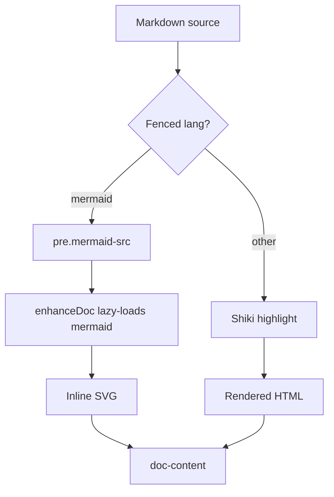

# Rendering completeness test

A fixture that exercises every renderer added in Arc 6: Mermaid diagrams, KaTeX
math, GitHub-style alerts, local images, external links, and a wide table.

## Mermaid diagram

## Math

Euler's identity relates five fundamental constants inline: $e^{i\pi} + 1 = 0$.
The quadratic formula is a more everyday example, $x = \frac{-b \pm \sqrt{b^2 - 4ac}}{2a}$,
and it's worth writing the general Gaussian integral on its own line:

$$
\int_{-\infty}^{\infty} e^{-x^2} \, dx = \sqrt{\pi}
$$

## Alerts

> [!NOTE]
> Highlights information that users should take into account, even when skimming.

> [!TIP]
> Optional information to help a user be more successful.

> [!IMPORTANT]
> Crucial information necessary for users to succeed.

> [!WARNING]
> Critical content demanding immediate user attention due to potential risks.

> [!CAUTION]
> Negative potential consequences of an action.

## Local image

A relative image, resolved through `/raw/*` against this document's directory:

## External link

Full rendering details live in the [markdown-it documentation](https://markdown-it.github.io/),
which opens in a new tab. A same-doc [jump to the math section](#math) stays in-page.

## Wide table

| Feature | Renderer | Client cost | Server cost | Notes |
| --- | --- | --- | --- | --- |
| Mermaid diagrams | `enhance.ts` (lazy chunk) | ~60 KB gzipped, loaded on demand | Escapes source into `data-diagram` | Re-renders on theme change from the original source |
| KaTeX math | `@mdit/plugin-katex` (server) | CSS only, loaded once per session | Full render to static HTML at request time | `hasMath` flag lets the client know whether to fetch the stylesheet |
| GitHub alerts | `markdown-it-github-alerts` (server) | none | Parsed at render time into `.markdown-alert` blocks | Icons disabled — mono label carries the kind |
| Local images | `/raw/*` route (server) | none | Extension whitelist + path-traversal guard | Root-absolute and relative sources both resolve |
| External links | renderer rule (server) | none | `target="_blank" rel="noopener"` added at render time | Anchors and relative links are left untouched |
